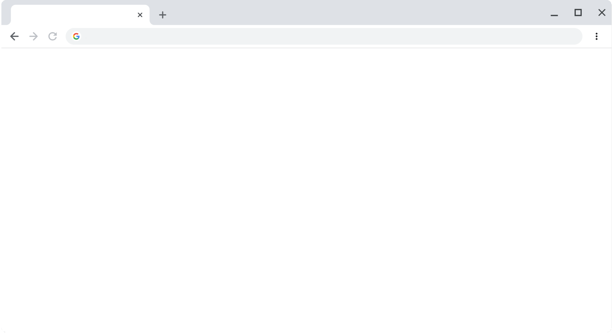

autoscale: true
slide-transition: true
theme: Fira
text: #c55749
header: #c55749

[.header: alignment(left), line-height(1)]
[.text: alignment(left), line-height(1)]
[.background-color: #c55749]



-
## Do You Want to Build a Browser Extension?
#### _Matthew Sheehan_

---

[.header: alignment(center), line-height(2), text-scale(1)]
[.text: alignment(left), line-height(1), text-scale(0.75)]
[.background-color: #c55749]


# Getting Started

- Focus on Chromium-based Browsers
  - Google Chrome, Microsoft Edge
  - Firefox compatibility: `https://www.extensiontest.com`

^ Firefox is highly compatible. Most of the changes are going to be simply finding and replacing the "chrome" namespace with the "browser" namespace.

- Focus on Manifest V3 WebExtension API
  - Service Workers and Promises

^ Chrome stopped accepting Manifest V2 extensions at the beginning of 2022
^ Before service workers there were "background" pages which also ran on a separate thread. But service workers is more in line with the Service Worker API used by PWA.

---

[.header: alignment(center), line-height(2), text-scale(1)]
[.text: alignment(left), line-height(1), text-scale(0.75)]
[.background-color: #c55749]


# Anatomy of a Browser Extension

- Manifest File

^ Manifest File. Used by al Chromium-based extensions
^ -> Manifest File. Gives information to the browser about the extension. Defines the files and capabilities of the extension, as well as what permissions the extension is requesting.

- Service Worker (background page)

^ Contains listeners for browser events. Dormant until needed when an event fires.
^ Has access to the Chrome extension APIs the extension has declared permission to.
^ Does not have access to the DOM
^ Does not have access to XMLHttpRequest
^ Does have access to fetch() API

- Content Script

^ Each script runs in an isolated world - has access to the DOM elements but runs in a separate execution environment. Variables, functions, etc are not accessible to the web page and vice versa.

- Toolbar Icon

^ Provides the user easy access to the extension UI

- Popup UI Elements

^ Works very similarly to a webpage. Can include stylesheets and scripts (but not inline javascript).

- Options Page


---

[.header: alignment(center), line-height(2), text-scale(1)]
[.text: alignment(left), line-height(1), text-scale(0.75)]
[.background-color: #c55749]
[.autoscale: false]


-
# Architecture


^ Background script listens for events from the browser and can also send messages back to the browser or to other extensions.

^ Content script has access to the webpage DOM and communicates to the background script and popup by sending and receiving messages.

^ Popup is loaded when the toolbar icon is clicked and loads any JS.

---

[.header: alignment(center), line-height(2), text-scale(1)]
[.text: alignment(left), line-height(1), text-scale(0.75)]
[.background-color: #c55749]
[.autoscale: true]


# Identifying the Components

[.column]


<!-- ```json
{
    "manifest_version": 3,
    "background": {
        "service_worker": "background.js"
    },
    "content_scripts": [
        {
            "matches": ["https://*/*"],
            "js": ["contentScript.js"]
        }
    ],
    "action": {
        "default_popup": "popup.html"
        ...
    }
    ...
}
``` -->

<sub>_*Condensed Manifest_</sub>

[.column]


^ Background script
  - single background script
  - must be located in extensions root directory

---

[.header: alignment(center), line-height(2), text-scale(1)]
[.text: alignment(left), line-height(1), text-scale(0.75)]
[.background-color: #c55749]
[.autoscale: false]


# Example 1 - Sideloading

- Chrome Developer Mode & Sideloading
- Starter Extension Template
  - `https://github.com/MattSheehanDev/chrome-manifest-v3-starter-template`

^ chrome://extensions
^ Chrome Developer Mode -> Load unpacked

---

[.header: alignment(center), line-height(2), text-scale(1)]
[.text: alignment(left), line-height(1), text-scale(0.75)]
[.background-color: #c55749]
[.autoscale: false]


# APIs and Permissions

- Chrome exposes a number of browser API's through the `chrome.*` namespace (`browser.*`)
- Some of these API's require requesting extra permission
  - Minimize requested permissions
  - Optional features with permissions can registered as `optional_permissions`
  - Users trust extensions with less permission warnings

^ We've all been there, so-and-so app needs access to locationServices and Blutooth, ... delete

---

[.header: alignment(center), line-height(2), text-scale(1)]
[.text: alignment(center), line-height(1), text-scale(0.75)]
[.background-color: #c55749]
[.autoscale: false]
[.table-separator: #000000, stroke-width(1)] 
[.table: margin(10)]


# Toolbar and Popup UI

| API | Permission|
|:---|---:|
| chrome.actions | none |

[.column]
```json
{
  "name": "Chrome Extension Action Manifest",
  "action": {
    "default_icon": {
      "16": "images/icon16.png",
      "24": "images/icon24.png",
      "32": "images/icon32.png"
    },
    "default_title": "tooltip text",
    "default_popup": "popup.html"
  }
  ...
}
```
[.column]
- `chrome.action.setIcon(...);`
- `chrome.action.setPopup(...);`


^ chrome.actions, control the extensions toolbar icon and toolbar popup UI
^ Each value is optional.
^ Each value can be programatically altered.

---

[.header: alignment(center), line-height(2), text-scale(1)]
[.text: alignment(left), line-height(1), text-scale(0.75)]
[.background-color: #c55749]
[.autoscale: false]
[.table-separator: #000000, stroke-width(1)] 
[.table: margin(10)]


# Toolbar and Popup UI

| API | Permission|
|:---|---:|
| chrome.declarativeContent | "declarativeContent" |

- TODO
- https://developer.chrome.com/docs/extensions/reference/declarativeContent/

---

[.header: alignment(center), line-height(2), text-scale(1)]
[.text: alignment(left), line-height(1), text-scale(0.75)]
[.code: auto(42), text-scale(1)]
[.background-color: #c55749]
[.autoscale: false]


# Events and Event Handling

- TODO
- https://developer.chrome.com/docs/extensions/mv3/migrating_to_service_workers/#events

<!-- # Other Common APIs

- chrome.tabs :arrow_right: `permissions: ["tabs"]`
  - Needed to communicate with a tab's Content Script

^ But can also do things such as create a new tab or modify the tab.

^ There are way to many extension APIs to cover all of them, but these are some common ones. -->

---

[.header: alignment(center), line-height(2), text-scale(1)]
[.text: alignment(left), line-height(1), text-scale(0.75)]
[.background-color: #c55749]
[.autoscale: false]


-
# Message passing :incoming_envelope:

- One-time messages


<!-- | API | Permission|
|:---|---:|
| chrome.actions | none | -->

^ - Content Scripts run in the context of the web page not the context of the extension, so they often need some way of communicating from the webpage to the extension.
  - They do this by communicating using messages.
    - Messages can be any JSON object that both sides (the extension and the content script) can listen for and respond to.

^ The `runtime.onMessage` event is fired in each content script running in the specified tab.

^ https://developer.chrome.com/docs/extensions/mv3/messaging/

<!--  -->

<!-- ```javascript

// contentScript.js, send message to background service worker
chrome.runtime.sendMessage({message: "hello"}, function(response) {
  console.log(response.message);
});


// background.js, send message to content script
chrome.tabs.sendMessage(tabId, {mesage: "hello"}, function(response) {
  console.log(response.message);
});


// contentScript.js or background.js listener
chrome.runtime.onMessage.addListener((request, sender, sendResponse) => {
  sendResponse({message: "goodbye"});
});

``` -->

---

[.header: alignment(center), line-height(2), text-scale(1)]
[.text: alignment(left), line-height(1), text-scale(0.75)]
[.background-color: #c55749]
[.autoscale: false]


-
# Message passing :incoming_envelope:

- Long-lived connections


^ Ports live as long as the frame on the other side is loaded

^ runtime.Port.onDisconnect to listen for when a tab is disconnected

<!-- ```javascript

// contentScript.js, connect to background service worker
var port = chrome.runtime.connect({name: "greet"});
port.postMessage({message: "hello"});
port.onMessage.addListener((msg) => { });

// background.js, connect to content script
var port = chrome.tabs.connect(tabId, {name: "greet"});
port.postMessage({message: "hello"});
port.onMessage.addListener((msg) => { });

// contentScript.js or background.js add listener
chrome.runtime.onConnect.addListener((port) => {
  port.onMessage.addListener((msg) => {
    port.postMessage({message: "goodbye"});
  });
});

``` -->

---

[.header: alignment(center), line-height(2), text-scale(1)]
[.text: alignment(left), line-height(1), text-scale(0.75)]
[.background-color: #c55749]
[.autoscale: false]


# Example 2 - Debugging the pieces

- Background Script Errors

^ When there is an error in the extension you will see an Errors button.

- Inspecting the Background Script

^ You can inspect the background script in chrome://extensions

- Content Script Logs

^ Content script logs log to the webpage console

- Inspecting the Popup UI

^ Popop UI logs log to their own console (inspect the popup html)


---

<!-- [.header: alignment(center), line-height(2), text-scale(1)]
[.text: alignment(left), line-height(1), text-scale(1)]
[.code: auto(42), text-scale(1)]
[.background-color: #c55749]
[.autoscale: true]
[.table-separator: #000000, stroke-width(1)] 
[.table: margin(10)]


# Service Workers - Quirks and Features

- Service workers are short lived execution environments
  

- 

--- -->

[.header: alignment(center), line-height(2), text-scale(1)]
[.text: alignment(left), line-height(1), text-scale(1)]
[.code: auto(42), text-scale(1)]
[.background-color: #c55749]
[.autoscale: true]
[.table-separator: #000000, stroke-width(1)] 
[.table: margin(10)]


# Service Workers - Persisting State

| API | Permission |
|:---|---:|
| chrome.storage | "storage" |

[.column]
- Service workers are short lived execution environments
  

[.column]


<!-- - Service workers are short lived execution environments -->

<!-- - Introducing the Storage API
  - Permissions: `"storage"` -->

<!-- 

 -->

<!-- ```javascript

chrome.storage.local.set({key: value}, () => {
  console.log(`${key} is set to ${value}`);
});

chrome.storage.local.get(['key'], (result) => {
  console.log(`Value of key is set to ${result.key}`);
});

``` -->

^ Serice workers are short lived execution environments.
  They start up, do some work, and will get terminated multiple times in a browser session
  This means that you can't have in-memory state

^ Instead you can use the Storage API which requires the storage permission
  You can also use `chrome.storage.sync` to sync settings to the users chrome profile.

^ Storage is persistent and asynchronous, works with Chrome sync.

^ Works very similar to the localStorage API exposed to the web browsers.
  A more robust version of the localStorage API

---

[.header: alignment(center), line-height(2), text-scale(1)]
[.text: alignment(left), line-height(1), text-scale(0.75)]
[.code: auto(42), text-scale(1)]
[.background-color: #c55749]
[.autoscale: false]


# Service Workers - Quirks

- TODO
- https://developer.chrome.com/docs/extensions/mv3/migrating_to_service_workers/#alarms

---

<!-- [.header: alignment(center), line-height(2), text-scale(1)]
[.text: alignment(left), line-height(1), text-scale(0.75)]
[.code: auto(42), text-scale(1)]
[.background-color: #c55749]
[.autoscale: false]


# Minimum Manifest File

```json
{
  // Required values
  "manifest_version": 3,
  "name": "Extension Name",
  "version": "0.0.1",

  // Recommended values
  "description": "Plain text description",
  "action": {...},
  "icons": {...},
}
```
https://developer.chrome.com/docs/extensions/mv3/manifest/

^ “name” - name of the extension as it appears in chrome web store and browser
  “version” - start small, 0.0.1, each update in the chrome web store has to be incremented
  “description” - 132 characters or less, plain text only (no html or other markup)
  “icons” - 16/32/48/128px size images (preferably PNGs)

^ “permissions” - request chrome api’s to use (ex. chrome.storage api, chrome.tabs api)
^ “host_permissions” - send CORS requests to specific webpages
^ “background.service_worker” — process that runs separately from the main browser js thread. Does not have access to the content of a webpage since it is a separate process.
   Can communicate using the extension messaging system
^ “content_scripts” — files that run in the context of the webpage that you are on. Can manipulate the DOM.
   - Content scripts can access Chrome APIs used by their parent extension by exchanging messages with the extension. They can also access the URL of an extension's file with chrome.runtime.getURL() and use the result the same as other URLs.
   - Has a match pattern, is injected into the webpage when url matches.
^ “default_popup” — file to specify as the main ui
^ “web_accessible_resources” - resources that are usually injected into the webpage. Allows the webpage to load the resources with the correct CORS headers to make them available.

^ toolbar icon
  - addtional icons
    - 16x16 - favicon on the extension page and the context menu icon
    - 32x32 - required by windows computers
    - 48x48 - displays on the extension management page
    - 128x128 - displays on installation and in the chrome web store
    - You may provide icons of any other size you wish, and Chrome will attempt to use the best size where appropriate. For example, Windows often requires 32-pixel icons, and if the app includes a 32-pixel icon, Chrome will choose that instead of shrinking a 48-pixel icon.

--- -->

[.header: alignment(center), line-height(2), text-scale(1)]
[.text: alignment(left), line-height(1), text-scale(0.75)]
[.background-color: #c55749]
[.autoscale: false]


# Example 3 - Full Extension

- Extension to track Hacker News comments

---

[.header: alignment(center), line-height(2), text-scale(1)]
[.text: alignment(left), line-height(1), text-scale(0.75)]
[.background-color: #c55749]
[.autoscale: false]


# Security considerations

- TODO
- https://developer.chrome.com/docs/extensions/mv3/messaging/#security-considerations
- https://developer.chrome.com/docs/extensions/mv3/xhr/

---

[.header: alignment(center), line-height(2), text-scale(1)]
[.text: alignment(left), line-height(1), text-scale(0.75)]
[.background-color: #c55749]
[.autoscale: false]


# Publishing your Extension

- Create a Chrome Web Store Developer Account
  - https://chrome.google.com/webstore/devconsole/register

- Zip and upload your extension

- Submit your extension
  - Justify any permissions your extension uses
  - Loading and executing remote code, as of Manifest V3, is not accepted
  - Make sure your extension has a single and narrow purpose.

^ Requesting permissions that your app does not use will result in your submission getting rejected.

^ Creating an extension that does too many things will result in your submission getting rejected.

^ There is another way to distribute your extension and that's going to `chrome://extensions` -> Pack extension. That wil create a CRX package that can be distributed on Linux.

